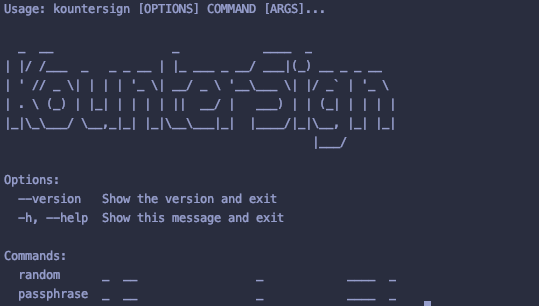
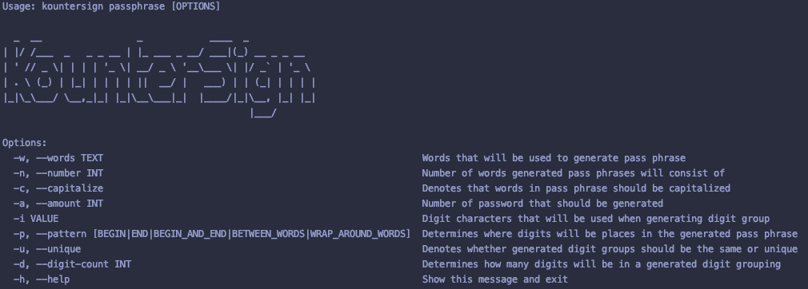
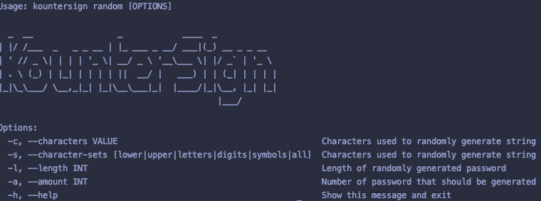

# Kounter Sign CLI
Basic command line interface that interfaces with Kounter Sign's password generation logic.

## Pass Phrase Command
Used to generate more memorable passwords instead of random nonsense.

## Random Command
Used to generate complete random non sense

